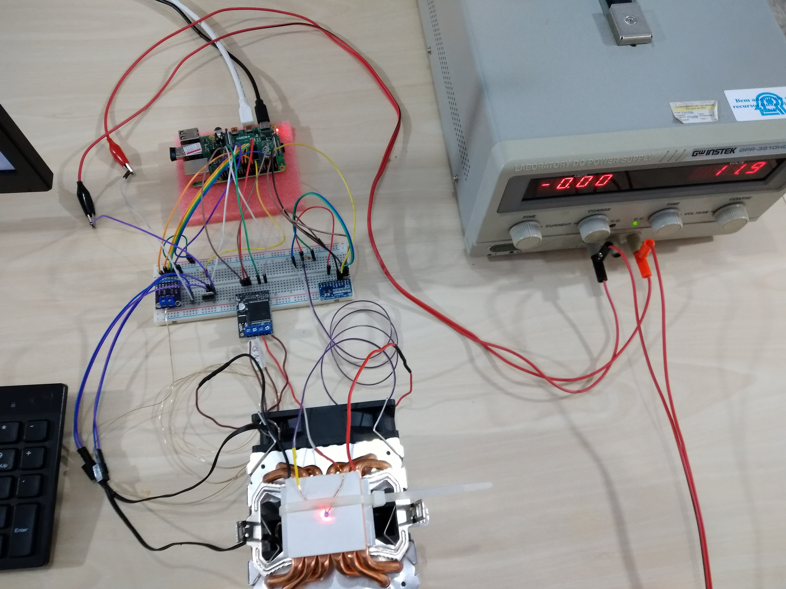
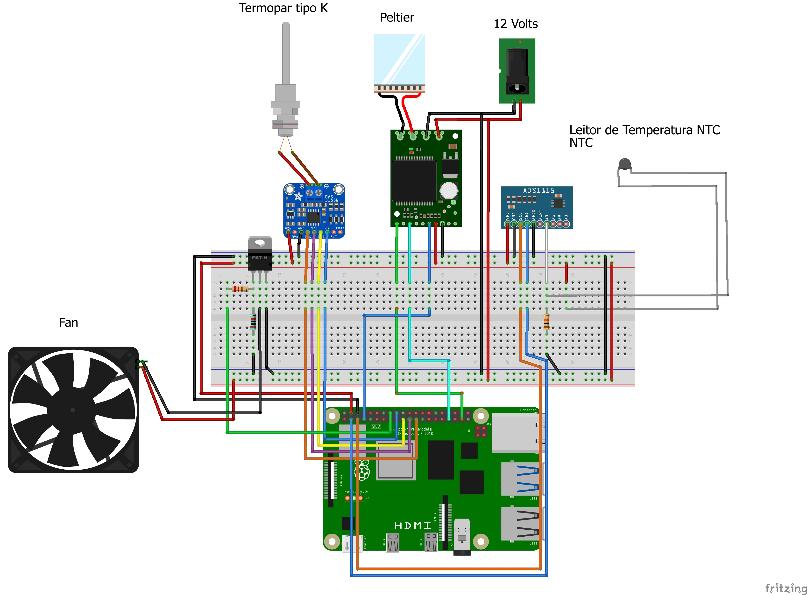
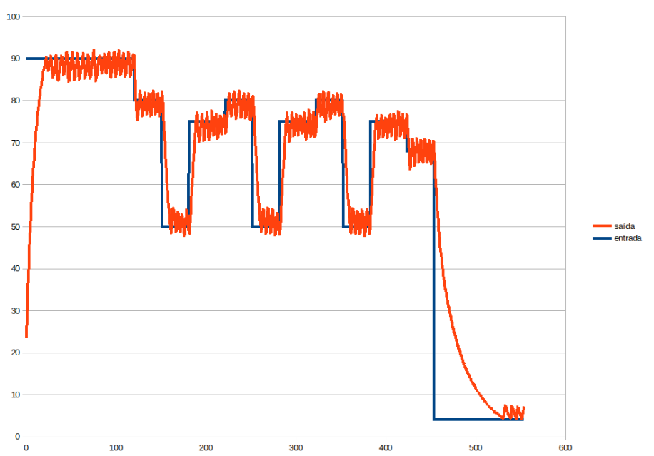

# Thermal Logic Pi

> Precise thermal control platform for Raspberry Pi using Peltier modules, auxiliary heating, and mixed sensor instrumentation.

<p align="center">
  
</p>

---

## 📷 Project Overview

Thermal Logic Pi is a low-cost embedded system built for accurate temperature regulation and controlled thermal cycling, created to serve as the thermal control backbone of a PCR-focused experimental platform.

The architecture combines solid-state thermal actuation with sensor-driven feedback to enable stable and repeatable temperature dynamics — a fundamental requirement for polymerase chain reaction workflows and related laboratory applications.

Initially developed in 2020, the system later supported the author’s undergraduate thesis (2025), where its hardware, software, and experimental results were formally documented and evaluated.

---

## 🔧 Hardware Platform

The system integrates:

- **Peltier (TEC) module** for bidirectional heating/cooling
- **Auxiliary heater** for thermal stabilization
- **Thermocouple Type-K** via MAX31856 (SPI)
- **NTC thermistor** via ADS1115 (I²C)
- **Raspberry Pi** as central controller
- External 12V power stage
- Active cooling (fan)

---

## 🖥 Electronic Design
<p align="center">
  
</p>
The control and sensing subsystems are separated into:

✔ High-power thermal actuation (Peltier / Heater)  
✔ Precision temperature sensing (thermocouple + NTC)  
✔ Digital interfaces (SPI / I²C)  

---

## 📊 Thermal Response Example
<p align="center">
  
</p>
Example output generated by the system showing:

- Temperature targets (setpoints)
- Sensor feedback
- Thermal dynamics during cycling
- Cooling response behavior

---
## 🛠 Recommended Build Environment (Raspberry Pi)

Thermal Logic Pi is designed to run on a Raspberry Pi with direct access to GPIO, SPI, and I²C interfaces.  
For best compatibility and stability, a native execution environment is recommended instead of containers or emulation.

**Recommended setup:**

- Raspberry Pi OS (or compatible Debian-based distribution)
- Python **3.11 or newer**
- SPI / I²C interfaces enabled via `raspi-config`
- Adequate permissions for GPIO access

---

### 1️⃣ Create Virtual Environment

Using a virtual environment is strongly recommended to isolate dependencies and avoid conflicts with system packages.

```bash
python3 -m venv .venv
source .venv/bin/activate
```
### 2️⃣ Install Dependencies

Upgrade pip and install project requirements:


```bash
pip install --upgrade pip
pip install -r requirements.txt
```

### 3️⃣ System Interfaces

Ensure required hardware interfaces are enabled:

sudo raspi-config

Enable:

✔ SPI
✔ I²C

Reboot the system if prompted.

### 4️⃣ Notes

Running directly on Raspberry Pi hardware ensures accurate timing and sensor behavior.

External power supply must support thermal loads (Peltier / Heater).

GPIO access may require elevated privileges depending on system configuration.

## 🚀 Running

Default execution:

```bash
python3 main.py
```

Custom temperature cycles:

```bash
python3 main.py \
  --heater-temp 37 \
  --cycle 4:60 \
  --cycle 15:120
```

Cycle format:

```
TEMP:DURATION
```

Example:

```
4:60 → Target 4°C for 60 seconds
```

## ⚙️ Hardware Configuration

Thermal Logic Pi is designed to operate with different hardware setups.  
Before running the system, adjust the hardware parameters according to your wiring and components.

All hardware-related constants are defined in:

```text
thermal_logic_pi/pin_config.py
```
### Configure Pins and Constants

Edit the configuration file to match your physical connections and sensor characteristics.

Typical parameters include:

PWM / Control Pins

Heater control pins

Peltier control pins

Cooling fan (if applicable)

Thermocouple Interface (MAX31856)

SPI Chip Select pin (SPI_CS_PIN)

NTC Sensor Parameters

Nominal resistance (R0)

Beta coefficient (BETA)

Series resistor value

ADS1115 channel selection

Example Adjustments

Depending on your hardware, you may need to modify:

✔ GPIO pin numbers
✔ PWM channels
✔ Sensor calibration constants
✔ ADC channel mappings

Incorrect configuration may result in unstable readings or improper thermal control.

Notes

Always verify wiring before applying power to the Peltier module.

Sensor calibration constants directly impact temperature accuracy.

SPI and I²C pins must match Raspberry Pi interface configuration.

## 📦 Output

Each execution generates:

- CSV telemetry dataset
- PNG temperature graph

Captured data includes:

✔ Measured temperature  
✔ Setpoints  
✔ Heater state  
✔ Thermal transitions  

---

## ⚠️ Hardware Notes

- Ensure proper heat dissipation for the Peltier module
- Validate sensor calibration before long cycles
- GPIO/SPI/I²C permissions may be required
- External power supply must support thermal load

---

## 🎯 Use Cases

- Experimental thermal systems  
- Embedded control studies  
- Low-cost instrumentation platforms  
- Microfluidics / PCR prototypes  
- Raspberry Pi hardware projects  

---

## 📚 Academic Context

This project was developed as part of an undergraduate research effort in Computer Engineering.

Official publication:

**Development of Electronic and Computational Infrastructure Based on Raspberry Pi for a Portable Low-Cost Microfluidic Platform Applied to PCR Assays**

Available at:

https://riu.ufam.edu.br/handle/prefix/8917

---

## 📂 Project Structure

```text
thermal-logic-pi/
├── main.py
├── requirements.txt
├── thermal_logic_pi/
│   ├── __init__.py
│   ├── controller.py
│   ├── heater.py
│   ├── peltier.py
│   ├── pin_config.py
│   ├── sensor.py
│   └── temperature_cycle.py
└── data/ (gerado automaticamente)
```
